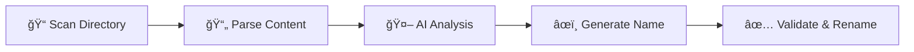

# Namewise

[](#-testing--development)
[](#-testing--development)
[](https://www.typescriptlang.org/)
[](https://nodejs.org/)
[](./LICENSE)

🤖 **AI-Powered File Renaming CLI Tool**

Automatically rename files based on their content using AI providers (Claude, OpenAI, Ollama, LMStudio). Transform messy filenames like `document1.pdf` or `IMG_20240315_143022.pdf` into descriptive names like `project-requirements-document.pdf` or `quarterly-sales-report-q4-2023.pdf`.

> **Perfect for**: Document management, file organization, bulk renaming based on content analysis

## Features

- **AI-Powered Renaming**: Uses cloud providers (Claude, OpenAI) or local LLMs (Ollama, LMStudio) to generate descriptive filenames
- **Privacy First**: Local LLM support means your files never leave your machine
- **Cost Effective**: Use free local models or pay-per-use cloud APIs
- **Personal File Templates**: Customizable templates for different file categories (documents, movies, music, series, photos, books)
- **Smart Categorization**: Automatic file type detection or manual category selection
- **Naming Convention Options**: 6 different formats (kebab-case, snake_case, camelCase, PascalCase, lowercase, UPPERCASE)
- **Multiple File Types**: Supports PDF, DOCX, DOC, XLSX, XLS, TXT, MD, and RTF files
- **Dry Run Mode**: Preview changes before renaming files
- **Conflict Detection**: Prevents overwriting existing files
- **Size Limits**: Configurable maximum file size limits

## 🚀 Quick Start

```bash
# Clone and setup
git clone https://github.com/amirdaraee/namewise.git
cd namewise
npm install
npm run build

# Rename files (dry run first)
npx namewise rename ./my-documents --dry-run --provider claude

# Actually rename with your API key
npx namewise rename ./my-documents --provider claude --api-key your-api-key
```

## 📦 Installation

### Option 1: Clone and Build
```bash
git clone https://github.com/amirdaraee/namewise.git
cd namewise
npm install
npm run build
npm link  # Optional: for global usage
```

### Option 2: Direct Download
Download the latest release from [GitHub Releases](https://github.com/amirdaraee/namewise/releases)

## 📖 Usage

### Command Structure
```bash
namewise rename <directory> [options]
```

### Options Reference
| Option | Description | Default |
|--------|-------------|---------|
| `--provider` | AI provider (`claude`, `openai`, `ollama`, `lmstudio`) | `claude` |
| `--base-url` | Base URL for local LLM providers | Auto-detected |
| `--model` | Model name for local LLM providers | Provider default |
| `--api-key` | API key for the chosen provider | Interactive prompt |
| `--case` | Naming convention (kebab-case, snake_case, camelCase, PascalCase, lowercase, UPPERCASE) | `kebab-case` |
| `--template` | File category template (document, movie, music, series, photo, book, general, auto) | `general` |
| `--name` | Personal name to include in filenames | - |
| `--date` | Date format (YYYY-MM-DD, YYYY, YYYYMMDD, none) | `none` |
| `--dry-run` | Preview changes without renaming | `false` |
| `--max-size` | Maximum file size in MB | `10` |

### 💡 Examples

**Basic usage (general template, no personalization):**
```bash
namewise rename ./documents --dry-run
# Result: quarterly-financial-report.pdf
```

**Personal documents with your name and date:**
```bash
namewise rename ./documents --template document --name "john" --date "YYYYMMDD" --dry-run
# Result: driving-license-john-20250905.pdf
```

**Movies with automatic detection:**
```bash
namewise rename ./movies --template auto --dry-run
# Result: the-dark-knight-2008.mkv
```

**TV series with season/episode detection:**
```bash
namewise rename ./shows --template auto --dry-run  
# Result: breaking-bad-s01e01.mkv
```

**Music with artist names:**
```bash
namewise rename ./music --template music --dry-run
# Result: the-beatles-hey-jude.mp3
```

**Snake case naming convention:**
```bash
namewise rename ./docs --case snake_case --dry-run
# Result: project_requirements_document.pdf
```

**Local LLMs (Privacy-First, No API Keys):**
```bash
# Ollama - requires 'ollama serve' running
namewise rename ./documents --provider ollama --dry-run
# Result: quarterly-financial-report.pdf

# Custom Ollama model
namewise rename ./code --provider ollama --model codellama --dry-run
# Result: user-authentication-service.js

# LMStudio - requires local server enabled
namewise rename ./contracts --provider lmstudio --dry-run
# Result: employment-agreement-template.docx

# Remote Ollama server
namewise rename ./files --provider ollama --base-url http://192.168.1.100:11434 --model llama3.1
```

**Cloud Providers (API Keys Required):**
```bash
# Claude (recommended for accuracy)
export CLAUDE_API_KEY=your-key
namewise rename ./documents --provider claude --dry-run

# OpenAI  
export OPENAI_API_KEY=your-key
namewise rename ./files --provider openai --max-size 20 --dry-run
```

**Before and After Example:**
```
📁 Before:
├── IMG_20240315_143022.pdf
├── document1.docx
├── Report Q4 2023 FINAL FINAL.xlsx

📁 After:
├── quarterly-financial-report-q4-2023.pdf
├── project-requirements-specification.docx
├── annual-sales-performance-summary.xlsx
```

## 📄 Supported File Types

| Type | Extensions | Parser |
|------|------------|---------|
| 📄 PDF Documents | `.pdf` | pdf-extraction |
| 📝 Microsoft Word | `.docx`, `.doc` | mammoth |
| 📊 Microsoft Excel | `.xlsx`, `.xls` | xlsx |
| 📋 Text Files | `.txt`, `.md`, `.rtf` | Native fs |

## 🎯 File Templates

Choose from specialized templates for different file types:

| Template | Pattern | Example Output | When to Use |
|----------|---------|----------------|-------------|
| `general` | `{content}` | `meeting-notes-q4-2024.pdf` | Default - simple descriptive names |
| `document` | `{content}-{name}-{date}` | `driving-license-john-20250905.pdf` | Personal documents, contracts, certificates |
| `movie` | `{content}-{year}` | `the-dark-knight-2008.mkv` | Movie files with release year |
| `series` | `{content}-s{season}e{episode}` | `breaking-bad-s01e01.mkv` | TV series episodes |
| `music` | `{artist}-{content}` | `the-beatles-hey-jude.mp3` | Music files with artist |
| `photo` | `{content}-{name}-{date}` | `vacation-paris-john-20240715.jpg` | Personal photos |
| `book` | `{author}-{content}` | `george-orwell-1984.pdf` | Books and ebooks |
| `auto` | *Automatic* | *Varies by detected type* | Let AI detect and choose best template |

## 🔑 AI Provider Setup

### 🏠 Local LLMs (Privacy-First, No API Keys)

**Ollama** - Recommended for privacy
1. Install: Download from [ollama.ai](https://ollama.ai)
2. Start server: `ollama serve`
3. Pull model: `ollama pull llama3.1` (or your preferred model)
4. Use: `--provider ollama`

**LMStudio** - User-friendly interface
1. Install: Download from [lmstudio.ai](https://lmstudio.ai)
2. Download and load a model in LMStudio
3. Enable "Local Server" mode in LMStudio
4. Use: `--provider lmstudio`

### ☁️ Cloud Providers (Require API Keys)

**Claude (Anthropic)** - Recommended for accuracy
1. Visit [Anthropic Console](https://console.anthropic.com/)
2. Create an account and generate an API key
3. Set as environment variable: `export CLAUDE_API_KEY=your-key`

**OpenAI**
1. Visit [OpenAI Platform](https://platform.openai.com/api-keys)  
2. Create an API key
3. Set as environment variable: `export OPENAI_API_KEY=your-key`

### 🚀 Quick Start by Privacy Preference

**Maximum Privacy (Local Processing):**
```bash
# Setup Ollama
ollama serve
ollama pull llama3.1

# Use locally - no data leaves your machine
namewise rename ./documents --provider ollama --dry-run
```

**Balanced (Cloud with API key):**
```bash
# Use Claude for best accuracy
export CLAUDE_API_KEY=your-key
namewise rename ./documents --provider claude --dry-run
```

> 💡 **Tip**: Local LLMs require no API keys and keep your data private. Cloud providers may offer better accuracy but require API keys and send data externally.

## ⚙️ How It Works



1. **📁 File Discovery**: Scans directory for supported file types
2. **📄 Content Extraction**: Uses specialized parsers to extract text content
3. **🤖 AI Processing**: Sends content to AI provider for filename suggestions
4. **✏️ Filename Generation**: Creates clean, kebab-case names
5. **✅ Safety Checks**: Validates conflicts and performs renaming

## 🛡️ Safety Features

- ✅ **Dry Run Mode**: Always preview changes first
- ✅ **File Size Limits**: Prevents processing overly large files  
- ✅ **Conflict Detection**: Won't overwrite existing files
- ✅ **Error Handling**: Graceful handling of parsing and API errors
- ✅ **Extension Preservation**: Keeps original file extensions
- ✅ **Comprehensive Testing**: 65 tests with 90%+ branch coverage

## 🧪 Testing & Development

```bash
# Development
npm run dev              # Run in development mode
npm run build           # Build TypeScript
npm start               # Run built version

# Testing  
npm test                # Run all tests
npm run test:coverage   # Coverage report
npm run test:ui         # Interactive test UI
```

The project includes comprehensive tests with 65 test cases covering all functionality except AI API calls (which are mocked).

## 🤝 Contributing

1. Fork the repository
2. Create a feature branch: `git checkout -b feature-name`
3. Make your changes and add tests
4. Run tests: `npm test`
5. Submit a pull request

## 📋 Requirements

- **Node.js**: 18.0.0 or higher
- **TypeScript**: 5.0.0 or higher  
- **AI Provider**: Choose one:
  - **Local**: Ollama or LMStudio (no API key needed)
  - **Cloud**: Claude (Anthropic) or OpenAI API key

## 🐛 Troubleshooting

<details>
<summary>Common Issues</summary>

**PDF parsing errors:**
- Ensure PDF is not password protected
- Check file is not corrupted
- Try reducing max-size limit

**API errors (Cloud providers):**
- Verify API key is valid
- Check internet connection
- Ensure sufficient API credits

**Local LLM connection errors:**
- Ensure Ollama server is running (`ollama serve`)
- Check LMStudio local server is enabled
- Verify correct base URL and port
- Confirm model is loaded/available

**Permission errors:**
- Check file permissions
- Run with appropriate user privileges
- Ensure files aren't in use by other applications

</details>

## 📝 License

[MIT License](./LICENSE) - Feel free to use, modify, and distribute this project.

---

<div align="center">
<strong>⭐ Star this repo if it helped you organize your files! ⭐</strong>

[Report Bug](https://github.com/amirdaraee/namewise/issues) • [Request Feature](https://github.com/amirdaraee/namewise/issues)
</div>